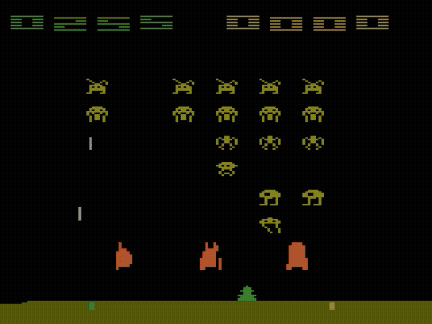
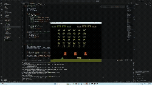
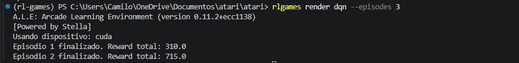

# Space Invaders — DQN desde cero

Repositorio para entender cómo funciona el Aprendizaje por Refuerzo entrenando un agente DQN sobre el entorno **Space Invaders** de Atari, usando la librería [Gymnasium ALE](https://ale.farama.org/environments/space_invaders/).

<p align="center">
  
</p>

---

## 1. Descripción del entorno: Acciones y Observaciones

### Observaciones — espacio visual preprocesado

El agente no recibe el juego en color ni en resolución original. La observación pasa por un pipeline de preprocesamiento estándar para Atari:

| Paso | Transformación | Resultado |
|------|----------------|-----------|
| 1 | Frame original RGB (210×160×3) | Imagen a color |
| 2 | `AtariPreprocessing` → escala de grises + resize | (84×84) |
| 3 | `FrameStackObservation` → apila 4 frames consecutivos | **(4, 84, 84)** |

El stack de 4 frames es clave: le da al agente información sobre **movimiento** (dirección de los invasores, trayectoria de los disparos) que un solo frame no puede capturar.

### Acciones — espacio discreto de 6 acciones

Space Invaders tiene un espacio de acción reducido y bien definido:

| Valor | Acción | Descripción |
|:-----:|--------|-------------|
| 0 | NOOP | No hacer nada |
| 1 | FIRE | Disparar sin moverse |
| 2 | RIGHT | Moverse a la derecha |
| 3 | LEFT | Moverse a la izquierda |
| 4 | RIGHTFIRE | Moverse a la derecha y disparar |
| 5 | LEFTFIRE | Moverse a la izquierda y disparar |

### Recompensas

El agente recibe puntos por destruir invasores. Los invasores de las filas traseras valen más puntos. No hay penalización explícita por recibir disparos enemigos — el episodio termina cuando el jugador pierde todas sus vidas o los invasores llegan a la Tierra.

---

## 2. Flujo lógico del entrenamiento DQN

El siguiente diagrama resume cómo el agente DQN interactúa con el entorno en cada paso:

```
┌─────────────────────────────────────────────────────────┐
│                     LOOP DE ENTRENAMIENTO               │
│                                                         │
│  Observación (4, 84, 84)                                │
│         │                                               │
│         ▼                                               │
│   ┌─────────────┐    ε-greedy    ┌──────────────────┐  │
│   │  Q-Network  │ ────────────► │  Acción (0 a 5)  │  │
│   └─────────────┘               └──────────────────┘  │
│                                          │              │
│                                          ▼              │
│                                    Entorno ALE          │
│                                          │              │
│                            (obs', reward, done)         │
│                                          │              │
│                                          ▼              │
│                              ┌─────────────────────┐   │
│                              │   Replay Buffer      │   │
│                              │   (100,000 transic.) │   │
│                              └─────────────────────┘   │
│                                          │              │
│                              Muestra aleatoria (32)     │
│                                          │              │
│                                          ▼              │
│                              ┌─────────────────────┐   │
│                              │  Actualización       │   │
│                              │  Q(s,a) ← r + γ·    │   │
│                              │  max Q_target(s',a') │   │
│                              └─────────────────────┘   │
│                                          │              │
│                              cada 1000 pasos            │
│                                          ▼              │
│                              ┌─────────────────────┐   │
│                              │  Target Network      │   │
│                              │  ← copia Q-Network   │   │
│                              └─────────────────────┘   │
└─────────────────────────────────────────────────────────┘
```

### Particularidades del entorno que afectan el entrenamiento

**Recompensas escasas al inicio:** En los primeros episodios el agente dispara aleatoriamente y raramente acierta. Esto hace que la curva de aprendizaje arranque lenta hasta que el buffer acumula suficientes experiencias de éxito.

**Exploración larga necesaria:** Con `epsilon_decay = 0.9995`, el agente tarda aproximadamente 1,400 episodios en bajar el epsilon por debajo de 0.5. Esto es intencional — Space Invaders requiere explorar muchas estrategias de movimiento antes de estabilizar una política.

**Sin reward shaping:** A diferencia de entornos como Donkey Kong donde la señal de recompensa es casi nula, Space Invaders provee recompensas inmediatas cada vez que un invasor es destruido. Esto hace innecesario el reward shaping y permite que el DQN aprenda directamente de la señal original del juego.

---

## 3. Arquitectura de la Red Neuronal

Se utiliza la arquitectura CNN original del paper de DeepMind (Mnih et al., 2015), diseñada específicamente para procesar observaciones visuales de juegos Atari.

```
Entrada: (batch, 4, 84, 84) — 4 frames en escala de grises, normalizados a [0, 1]
         │
         ▼
Conv2D(4→32, kernel=8×8, stride=4)  → (batch, 32, 20, 20)
ReLU
         │
         ▼
Conv2D(32→64, kernel=4×4, stride=2) → (batch, 64, 9, 9)
ReLU
         │
         ▼
Conv2D(64→64, kernel=3×3, stride=1) → (batch, 64, 7, 7)
ReLU
         │
         ▼
Flatten → (batch, 3136)
         │
         ▼
Linear(3136 → 512)
ReLU
         │
         ▼
Linear(512 → 6)  ← un valor Q por cada acción posible
```

### ¿Por qué esta arquitectura?

Las capas convolucionales extraen características visuales jerárquicas: la primera detecta bordes y texturas básicas, la segunda detecta patrones más complejos como las siluetas de los invasores, y la tercera combina esos patrones en representaciones de alto nivel. Las capas fully connected finales mapean esas representaciones a valores Q para cada acción.

### Hiperparámetros del agente

| Parámetro | Valor | Justificación |
|-----------|-------|---------------|
| `lr` | 1e-4 | Ritmo conservador para estabilidad en redes neuronales |
| `gamma` | 0.99 | Alta importancia a recompensas futuras |
| `epsilon_start` | 1.0 | Exploración total al inicio |
| `epsilon_end` | 0.01 | Mínima exploración al final |
| `epsilon_decay` | 0.9995 | Transición gradual a explotación |
| `batch_size` | 32 | Gradiente estable sin saturar memoria |
| `buffer_capacity` | 100,000 | Diversidad de experiencias para el muestreo |
| `target_update_freq` | 1,000 pasos | Evita el problema de moving target |
| `learning_starts` | 10,000 pasos | El agente explora antes de empezar a aprender |
| `loss_fn` | Huber (SmoothL1) | Más estable que MSE ante outliers de recompensa |

---

## 4. Resultados del Entrenamiento

El agente fue entrenado durante **3,000 episodios** sobre una GPU NVIDIA GeForce RTX 3060 Ti en aproximadamente 4 horas.

### Curva de aprendizaje (promedio cada 20 episodios)

| Episodio | Avg Reward | Epsilon | Observación |
|----------|-----------|---------|-------------|
| 20 | 164.25 | 0.990 | Exploración pura, buffer llenándose |
| 200 | 174.25 | 0.905 | Buffer lleno, aprendizaje activo |
| 800 | ~250 | 0.670 | Mejora sostenida |
| 1,300 | 356.50 | 0.522 | Nuevo mejor modelo |
| 1,400 | 382.25 | 0.496 | Nuevo mejor modelo |
| 2,600 | **429.75** | 0.272 | **Mejor resultado del entrenamiento** |
| 3,000 | 377.50 | 0.230 | Final del entrenamiento |

**Mejor promedio alcanzado: 429.75** (episodio 2,600)

### Resultados en ejecución real (render)

<p align="center">
  
</p>

| Episodio | Reward total |
|----------|-------------|
| 1 | 310 |
| 2 | **715** |

como podemos ver aunque pusimos que se renderizara en tres episodios solo se logro en dos ya que nuestro agente logro superar el ejercicio por completo, esto se sale de nuestras espectativas ya que nuestro mejor promedio en entrenamiento fue de 429 como mostramos anteriormente

<p align="center">
  
</p>

---

## 5. Reflexión de los Resultados

Al observar al agente jugar se pueden identificar comportamientos interesantes que reflejan exactamente lo que aprendió la red — y también sus limitaciones.

El agente desarrolló una **puntería notable**: raramente falla un disparo cuando tiene a un invasor en línea de fuego. Esto tiene sentido dado que la recompensa inmediata por destruir un invasor es la señal más clara que recibe durante el entrenamiento, y la red aprendió rápidamente a maximizarla.

Sin embargo, también es evidente una **limitación estructural del DQN básico**: al agente no le importa sobrevivir por sí mismo — solo le importa acumular puntos. Cuando recibe un disparo enemigo no lo percibe directamente como algo negativo (ya que la penalización solo llega al perder una vida y terminar el episodio), por lo que a veces toma decisiones de movimiento torpes, como intentar "esquivar" un disparo pero moviéndose justo hacia él. El agente prioriza posicionarse para disparar sobre posicionarse para sobrevivir.

Este comportamiento es una consecuencia directa del diseño de recompensas del juego original: Space Invaders no penaliza recibir disparos paso a paso, solo penaliza perder vidas. Con más episodios de entrenamiento o con reward shaping adicional (penalizar cada vida perdida), el agente probablemente desarrollaría mejores estrategias defensivas.

---

## 6. Reflexión: Lo que más costó

El mayor reto de este proyecto no fue técnico sino conceptual: **lograr que un DQN sencillo aprenda a valorar la supervivencia y no solo la puntuación**.

La primera versión del entorno que intentamos fue **Donkey Kong**, donde descubrimos de primera mano el problema de recompensas escasas — el agente recibía todas las recompensas en bloque al final del episodio, sin señal intermedia. Esto hacía imposible que aprendiera qué acción específica era la correcta. A pesar de implementar reward shaping usando la RAM del juego para detectar la posición vertical del jugador, el agente no logró aprender a avanzar de manera consistente.

Esto nos llevó a cambiar a **Space Invaders**, donde la señal de recompensa es inmediata y clara, demostrando que la elección del entorno es tan importante como el algoritmo.

Otro limitante significativo fue el **poder de cómputo**. Con una GPU RTX 3060 Ti cada entrenamiento tomaba entre 2 y 4 horas, lo que hacía muy costoso experimentar con distintos hiperparámetros. Con mejores condiciones de cómputo (o acceso a múltiples GPUs) sería posible hacer búsquedas de hiperparámetros sistemáticas y probablemente obtener resultados notablemente mejores.

Finalmente, **adaptar el código existente** para un nuevo entorno requirió entender en profundidad cada componente del pipeline: el preprocesamiento de frames, la compatibilidad entre wrappers de Gymnasium, el manejo de la RAM de ALE, y la interacción entre el CLI y el agente. Cada cambio aparentemente pequeño podía romper silenciosamente el entrenamiento completo.

---

## Setup

```bash
uv sync
source .venv/bin/activate   # Linux / macOS
.venv\Scripts\activate      # Windows

# Instalar ROMs de Atari
autorom --accept-license

# Instalar PyTorch con soporte CUDA (recomendado)
uv pip install torch --index-url https://download.pytorch.org/whl/cu128
```

## CLI

```bash
# Inspeccionar el entorno
rlgames inspect

# Entrenar
rlgames train dqn --episodes 3000

# Simular (texto)
rlgames sim dqn --episodes 3

# Renderizar (ventana gráfica)
rlgames render dqn --episodes 3
```

## Estructura del proyecto

```
src/rl_games/
├── cli.py              # CLI entry point
└── agents/
    └── dqn.py          # Agente DQN desde cero (PyTorch)

saves/                  # Modelos guardados
assets/                 # Imágenes y GIFs para el README
```